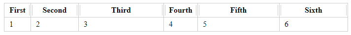

# vue-resize-table


## Project setup
```
npm install
```

### Compiles and hot-reloads for development
```
npm run serve
```

## Импорт и Настройка
####### main.js
```
import vueTableResize from "@/plugin/vue-table-resize/vue-table-resize";

// Если нужны стили
import "@/plugin/vue-table-resize/style/main.scss";

Vue.use(vueTableResize);
```

### Настраиваемые параметры таблицы
```
<table
    v-resizable
    tableClass: "table__resize-table", // Класс таблицы
    gripClass: "table__resize-grip", // Класс хэндлера
    gripActiveClass: "table__resize-grip--active", // Активный класс хэндлера
    tableId: null, // id таблицы
    emit: null, // имя события, возвращает DOM.element колонки размер которой изменяется
    ...
></table>
```

### HTML
```
<table v-resizable>
    <thead>
        <tr>
          <th>...</th>
          <th>...</th>
          <th>...</th>
        </tr>
      </thead>
      <tbody>
        <tr>
          <td>...</td>
          <td>...</td>
          <td>...</td>
        </tr>
      </tbody>
</table v-resizable>
```

### CSS 
```
.table__resize-table {
  .....
  }

  th {
    ...
  }
}

.table__resize-grip {
  ...

  &:hover {
    ...
  }
}

.table__resize-grip--active {
  ...
}
```
